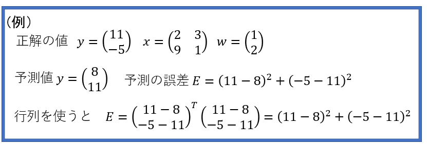

# カーネル法によるフィッティングに関して勉強してみよう

この記事は、MATLABアドベントカレンダー（その2）の11日目の記事として書かれています。

本記事の執筆にあたっては、

赤穂先生の「カーネル多変量解析」を非常に参考にさせていただきました。

[https://www.amazon.co.jp/%E3%82%AB%E3%83%BC%E3%83%8D%E3%83%AB%E5%A4%9A%E5%A4%89%E9%87%8F%E8%A7%A3%E6%9E%90%E2%80%95%E9%9D%9E%E7%B7%9A%E5%BD%A2%E3%83%87%E3%83%BC%E3%82%BF%E8%A7%A3%E6%9E%90%E3%81%AE%E6%96%B0%E3%81%97%E3%81%84%E5%B1%95%E9%96%8B-%E3%82%B7%E3%83%AA%E3%83%BC%E3%82%BA%E7%A2%BA%E7%8E%87%E3%81%A8%E6%83%85%E5%A0%B1%E3%81%AE%E7%A7%91%E5%AD%A6-%E8%B5%A4%E7%A9%82-%E6%98%AD%E5%A4%AA%E9%83%8E/dp/4000069713](https://www.amazon.co.jp/%E3%82%AB%E3%83%BC%E3%83%8D%E3%83%AB%E5%A4%9A%E5%A4%89%E9%87%8F%E8%A7%A3%E6%9E%90%E2%80%95%E9%9D%9E%E7%B7%9A%E5%BD%A2%E3%83%87%E3%83%BC%E3%82%BF%E8%A7%A3%E6%9E%90%E3%81%AE%E6%96%B0%E3%81%97%E3%81%84%E5%B1%95%E9%96%8B-%E3%82%B7%E3%83%AA%E3%83%BC%E3%82%BA%E7%A2%BA%E7%8E%87%E3%81%A8%E6%83%85%E5%A0%B1%E3%81%AE%E7%A7%91%E5%AD%A6-%E8%B5%A4%E7%A9%82-%E6%98%AD%E5%A4%AA%E9%83%8E/dp/4000069713)

非常にわかりやすい書籍であり、大変おすすめです。

なお、本記事では、機械学習の中でも非常に有名な、サポートベクトルマシン（SVM）を理解するうえで非常に重要な手法（カーネル法）を扱います。機械学習を学習している方の参考になれば幸いです。本記事は自分の勉強のまとめであり、厳密でない記述や間違いなどあるかもしれません。その場合は教えていただけますと幸いです。


# 1. はじめに

これまでの記事で、線形回帰について、詳しく述べてきました。そこで用いた図の例としては以下のようなものがあります。しかし、この例では、決定係数も約0.3とあまりうまくフィッティングすることができていません。また、次数を上げて、3次式などでフィッティングしても、ある程度の残差出てしまうことが予想されます。


上の図のような、y = ax+bで表されるような、線形的な回帰ではなく、非線形なフィッティングを考えたいと思います。

ここで、本記事にて、勉強した内容をもとに、カーネル法によるフィッティングを筆者が1から実装してみました。その結果の様子をご覧ください。

サンプルの点（青）に対して、うまくフィッティングできている（赤）ことがわかります。


さきほどの線形回帰よりも、ぐにゃぐにゃとした線でフィッティングされていることがわかります。

このような複雑な形状でフィッティングするにはどのような方法を取ればよいのでしょうか。

2章や3章にて、このフィッティングをするための式について考えていきます。

# 2. 線形回帰（複数の変数）を行列で表現する

2章では、以前のブログ記事で行った、線形回帰の式の導出を、行列を用いて行います。また、この場合は、変数の数が多くなっても、うまく対応することができます。


線形回帰のときは y=ax+bという式を用意し、以下のように、各yの値と、予測した値の差の2乗の値が最も小さくなるような、aとbの値を求めました。


...(2-1)

そして、これらを解くことで、以下のような、aを求める式を得ました。


...(2-2)

  

この場合は、変数が1つの場合でしたが、今回は、変数がもっと多くなっても対応できるようにしたいと思います。

そのために、さきほどの線形回帰の傾きaや切片bを求めるための式を行列で書いてみることにします。

xやyは以下のようになります。これは、サンプル数が4つ（データが4件）あることを意味します。xの場合、データの値は、2、6、4、2です。


...(2-3)

yについても同様です。


...(2-4)

傾きのaについては、どのデータに対しても同じ値が用いられるため、単純に、以下のようにあらわせます。


...(2-5)

次に、変数の数が多くなっ他場合を考えます。y = ax1+bx2+cx3+dx4+....のような形です。

以下の式(6)の縦方向がサンプルの数、横方向が変数の次元数であるとします。


...(2-6)

例えば、以下の式を見てください。先ほどと同様にデータが4つあるとします。1つ目の変数のデータの値は、2、6、4、2です。横方向は3列ありますが、変数が3つあることを表しています。


...(2-7)

yについては、さきほどと変わりません。


...(2-8)

傾きの値は、重みとして、wで表すことにします。変数が3つあるのでそれに対応する形で、3つの要素があります。


...(2-9)

切片に相当するものはここでは考えないとすると、(1)式を(7)や(9)式を用いて書くと以下のようになります。


...(2-10)

i番目のデータに対して、それぞれの対応する重みを掛けて、それとi番目のyの値との差を取ります。さらにその値を2乗します。

そして、それをデータの数だけ繰り返し、足していくことで、予測値と実際の値の差の2乗の和、つまり偏差平方和を求めることができます。

これを行列で書くと以下のようになります。


...(2-11)

という所が少し分かりにくいと思います。以下に例を上げさせてください。

予測の誤差を2乗して、足すという計算が、行列の転置を使うと、簡単に表現することができます。



そして、式(2-11)の値が最小になる、重みwの値を求めたいので、*w*で微分をし、その値が0になる値を求めたいと思います。


...(2-12)

ここで、転置を含むときの微分の式は以下のようになります。


...(2-13)

式(2-12)と(2-13)を見比べると、


...(2-14)


...(2-15)


...(2-16)

これが0になるとき、


...(2-17)

となって、wについて解くと、


...(2-18)

となります。

このように、*w*について、変数が複数ある場合でも、解析的に、誤差を最小にする重み*w*を求めることができることがわかりました。

# 3. カーネル法の利用
### 3.1. カーネル法を用いた時の誤差の最小化

このように、線形回帰を行うときの、重み*w*を求める方法はわかりましたが、この方法では、うまくフィッティングできるデータにも限りがあります。より柔軟なフィッティングができるように、カーネル法というものを導入したいと思います。

以下の例の、①や②では、足し算と引き算を行っています。別な言い方をすると、足し算や引き算をするときのルールのもと、計算しています。③でも同様に、カーネルaという筆者がここで定めた方法で計算して、その結果0という値を得ました。ちなみに、ここでは、カーネルaという計算のルールでは、2つのベクトルの内積を計算する、というふうにしました。


よく用いられるカーネルとして、ガウシアンカーネルというものがあります。その式を以下に示します。


...(3-1)

βは任意に設定できるパラメータです。の計算については以下の例をご覧ください。

要素の2乗をして、その和を取り、その平方根を求めています。つまり、


...(3-2)

としています。


この式をグラフに表すと以下のようになります。横軸は、 の値です。


さきほどの、y=ax+bのような形式は以下のように計算できました。つまり、i番目の変数に対する重みと、i番目の変数をかけ合わせ、そしてそれらの和を計算していました。

カーネル法を用いた場合も同様です。ただ、この場合は、カーネル法の計算の*K*の箇所が挟まります。


...(3-3)

カーネル法では、インプットしたxに対して、他の各サンプルxiとのカーネルの値に変換し、それを、重みwと掛け合わすことをしています。

例えば、サンプル数3で、変数の数（次元）が2のデータがあったとします。このデータをもとに以下のデータをテストデータとして計算する時を考えます。


...(3-4)

テストデータは1つなので、サンプル数は1、次元は同様に2です。


そして、式3-2の

  

の部分では、

(2,3)と(2,8)を使って計算をして、

(9,1)と(2,8)を使って計算をして、

(-3,1)と(2,8)を使って計算をして、

それらを最終的に以下のように計算するイメージです。

数式で表すと式3-3のようになります。

そして1章で示した、線形回帰の誤差を計算するための式を再掲します。


...(1-1)

線形回帰の場合は上のような式でしたが、

同様に、カーネル法を用いた場合でも以下のように、偏差平方和を定義できます。


...(3-5)

この式を最小化する、wを求めたいと思います。

まず、その下準備を行います。


...(3-6)

は、xのi番目と、j番目の値を用いて、カーネルの値を計算するとします。

これをもとに、行列の (i, j) 成分をその値とする行列Kを準備します。つまり、


...(3-7)

を定義します。これをグラム行列（**Gram matrix**）と呼びます。

グラム行列の定義や性質については以下の記事がわかりやすかったです。

https://mathlandscape.com/gram-matrix/

ここでも同様に、


の結果を重み付けするために、


...(3-8)

を用意します。

すると、

式3-5は、


...(3-9)

と表すことができます。

  

ここで、線形回帰の場合は、以下の式を解きました。


...(3-12)

つまり、xがKになっただけで、同じ形になっていることがわかります。

そこで、2-18のxとKを入れ替えて、

この3-9の式が最小となる、wの値は、


...(3-10)

であることがわかります。

### 3.2. グラム行列の特性を生かして解き進める

ここで、2-1のように、今回は以下のようなカーネル関数を用いていました。


ここでは、aとbの値を引いて、2乗の計算をするため、aとbを入れ替えても同じ値になります。

つまり、

　

...(3-11)

です。

そのため、2-7からわかるように、グラム行列は


...(3-12)

を満たします。これを利用して、3-10を解き進めると、


...(3-13)

となることがわかります。

### 3.3. カーネル法を利用した時の誤差の和（残差平方和）について

線形回帰の場合は、誤差の二乗の和が最小となるwを選んでも、完全にそのデータに適合する直線は得られない場合がほとんどでした。そして、そのときの直線の当てはまり具合を決定係数などで評価していました。今回のようなカーネル法を利用した場合の、残差平方和はどうなるでしょうか。3-9に、 を代入します。すると、


となります。つまり、

　で、カーネル法を用いてフィッティングしたときのトレーニングデータに対する

**誤差はゼロとなります**。

つまり、以下の図のように、青色のサンプルに対して、赤線のようにフィッティングを行うと、

与えられたサンプル全てを漏れなく通る、式を得ることができます。


### 3.4. 正則化項について

これまでは誤差が全くない（ゼロ）のフィッティングを行うことができることを勉強してきました。

しかし、サンプルの数（次元）が多くなるほど、そのトレーニングデータに過適合してしまいます。例えば、トレーニングデータ中にノイズの点が含まれていると、その点に引っ張られてしまいます。

つまり、トレーニングしたデータに対してはうまく行くが、それがうまくいきすぎて、逆に他の新たなデータに対しては、うまく行かないという問題が考えられます。つまり、低い汎化性が問題になります。

そこで正則化項という、このフィッティングの具合を下げるためのものを考えます。

以下のように、誤差の式にを足します。


...(3-14)

は2次形式であるため、微分の結果もシンプルになり、

となります。これにより、重みの計算もやりやすくなりそうです。

[https://manabitimes.jp/math/1240](https://manabitimes.jp/math/1240)

また、この微分に関しては、さきほどの、1-13式に、c=0, d=0, A=λ, B=Kを代入しても同じ結果が得られます。


...(2-13)

という項が入ると、さきほどのように、トレーニングデータに対して、完全にフィッティングすることはできません。しかし、それにより、トレーニングデータに過剰に適合することを抑えることができます。

3-14を微分して、


...(3-15)

この値が0になるときは、以下の式を満たす。


...(3-16)


...(3-17)


...(3-18)

このような重みwを選ぶことで、トレーニングデータに過適合しないようなフィッティング結果が得られます。しかし、この正則化の程度をコントロールする、係数λを適切に選ぶ必要があります。

## 3.5. カーネルについてもう少し考えてみる

先ほどは、カーネルの関数として、ガウシアンカーネルを利用しました。

（これがカーネルとして利用できるかは置いておいて）、以下のような関数をカーネルとして選んだとします。


...(3-19)

すると、以下のように6次元のベクトルの内積として書き換えることができます。


  

なお、この節での説明は以下のページを参考にさせていただきました。

  

**How to intuitively explain what a kernel is?**

[https://stats.stackexchange.com/questions/152897/how-to-intuitively-explain-what-a-kernel-is/153134\#153134](https://stats.stackexchange.com/questions/152897/how-to-intuitively-explain-what-a-kernel-is/153134#153134)

**カーネルとは直感的に説明するとなんなのか？**

[https://qiita.com/keisuke-nakata/items/9d46152ac52dcd2cc92a](https://qiita.com/keisuke-nakata/items/9d46152ac52dcd2cc92a)

**機械学習に詳しくなりたいブログ**

[https://www.iwanttobeacat.com/entry/2019/09/19/211840](https://www.iwanttobeacat.com/entry/2019/09/19/211840)

  

次に、ガウシアンカーネルについて、同様に、n次元のベクトルの内積に書き換えられないかを考えてみます。

ガウシアンカーネルは以下のように定義されていました。


ここで、


とおきます。これをテーラー展開 **(Taylor expansion)**すると以下のようになります。


...(3-20)

ガウシアンカーネルも、無限次元のベクトルの内積に書き換えられる気がしてきました。

ここから、ガウシアンカーネルを無次元特徴量として表すための、式展開は、以下のようになります。

**なお、この式展開については、**

**佐久間淳先生　機械学習(6)カーネル/確率的識別モデル1の講義資料をそのまま掲載させていただいております。**

非常にわかりやすい資料を公開していただき、ありがとうございました。

https://ocw.tsukuba.ac.jp/wp/wp-content/uploads/2019/10/e279a56fc6a000e67d6370309f9374c1.pdf


このように、ガウシアンカーネルを用いた時は、無限次元の特徴量を計算していることと等しいです。

次元が無限だけあるので、これを全て1からコツコツ計算していくことは、（真正面から計算する場合は）できません。

しかし、ガウシアンカーネルを用いた上の計算をすると、この無限次元の計算をした場合と等価になります。

このようにカーネルとして利用できる関数をもってくれば，無限次元の特徴ベクトルの内積を非常に簡単に計算できます。これは**「カーネルトリック」**と呼ばれています。

# 4. カーネル法を用いたフィッティングを実装してみよう
## 4.1. 正則化項を使用しない場合

3章までは、カーネル法を用いたフィッティングを行うことで、線形回帰よりもはるかに柔軟性のあるフィッティングを行うことができることを示してきました。4章では、これまでの理解を確認および定着させるために、実際にそれらをコーデイングして、うまくいくか確認してみたいと思います。

言語はMATLABを用いました。3章までの数式をもとに実装しました。いったん数式を解いてしまえば、比較的短い行で書くことができました。正則化項を使用しない場合は、上で説明したとおり、サンプルデータに完全にフィットする結果を得ることができました。

```matlab:Code
clear;clc;close all
%% パラメータ設定
% ガウシアンカーネル中のベータの値
beta = 1;
% 正則化のパラメータ
L2regu = 0;
%% サンプルデータの作成と計算の準備
rng('default') % For reproducibility
x_observed = linspace(0,10,21)';
y_observed1 = x_observed.*sin(x_observed);
y_observed2 = y_observed1 + 0.5*randn(size(x_observed));
numSample = numel(x_observed);
K = zeros(numSample, numSample);
%% グラム行列の計算
% わかりやすくfor文を2つ用いて実装します
for i =1:numSample
    for j = 1:numSample
        diff = (x_observed(i)-x_observed(j))^2;
        K(i,j) = exp(-beta*diff);
    end
end
%% 重みwの計算
w = inv((K+L2regu*eye(numSample)))*y_observed2;
%% 結果の可視化
% サンプルデータのプロット
figure;scatter(x_observed,y_observed2);hold on
% フィッティングした結果のプロット
numSample_test = 100;
x_test = linspace(0,10,numSample_test)';
kOut = zeros(numSample_test,1);
for i =1:numSample_test
    x_i = x_test(i);
    diff_test = (x_observed-x_i).^2;
    kOut(i) = w'*exp(-diff_test.*beta);
end

plot(x_test,kOut)
title(sprintf('L2正則化の係数=%d',L2regu));hold off
```


## 4.2. 正則化項を変えながら実行する

4.1では、正則化項を利用しませんでした。以下の図は、正則化項のパラメータを変えながら実行した時の様子です。この図のコードもgithubにアップロードしています。正則化項の係数が小さくなる（影響を小さくする）と、真ん中下の、急に値が小さくなっている点にも適合しようと、曲線全体がより複雑になっていることがわかります。


# 5. まとめ

   -  カーネル法を用いたフィッティングの方法についてまとめました 
   -  トレーニングデータに対して、誤差のない、複雑な曲線を描くことができます 
   -  自身の手でも実装し、勉強したとおりのフィッティングができることを確認しました 
   -  機械学習において、非常に有名な、サポートベクトルマシンを理解するうえで非常に重要なトピックを扱いました。サポートベクトルマシンを学習しているかたの参考になれば幸いです。 

# 参考ページ（本文中に記載のないもの）

**線形な手法とカーネル法（回帰分析）**

[https://qiita.com/wsuzume/items/09a59036c8944fd563ff](https://qiita.com/wsuzume/items/09a59036c8944fd563ff)
